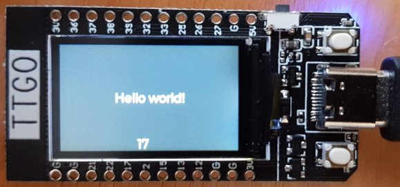

# ESP32 TTGO-TDisplay LVGL Template

Hello world base project for TTGO-TDisplay board using LVGL.



- [TTGO TDisplay Github](https://github.com/Xinyuan-LilyGO/TTGO-T-Display)
- [Product page](http://www.lilygo.cn/prod_view.aspx?TypeId=50033)
- [LVGL Core](https://github.com/lvgl/lvgl)
- [LVGL Drivers](https://github.com/lvgl/lvgl_esp32_drivers)
- [LVGL Example Repo](https://github.com/lvgl/lv_port_esp32)

## Usage

Clone and checkout submodules.

```
git clone --recurse-submodules https://github.com/stuianna/esp-ttgo-tdisplay-lvgl.git
```

`ttgo-t-display.patch` must be applied to `components/lvgl_esp32_drivers` until [this](https://github.com/lvgl/lvgl_esp32_drivers/issues/50) issue is resolved.

```
git apply --ignore-space-change --ignore-whitespace --inaccurate-eof ttgo-t-display.patch --directory  components/lvgl_esp32_drivers  
```

Build and flash
```
idf.py build
idf.py -p PORT [-b BAUD] flash
```